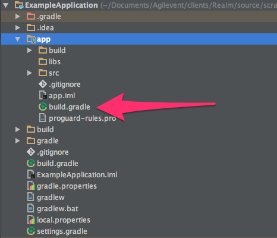
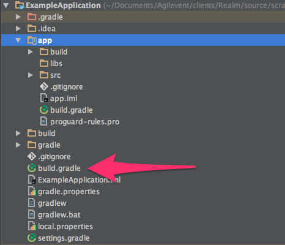
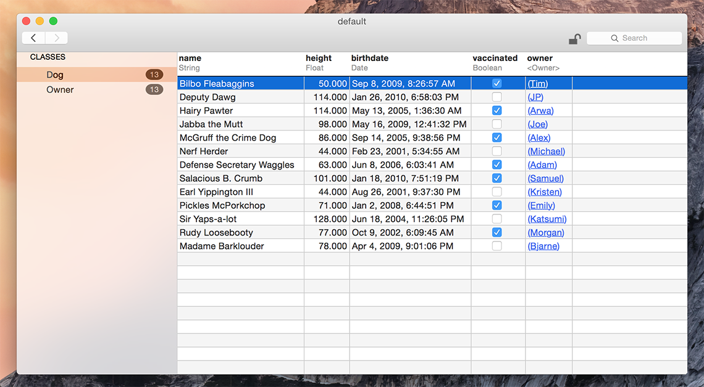
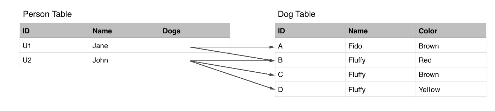

Realm Java可以高效的、安全的、快速的持久化app中的model层数据.
=============================================
[Realm官网](https://realm.io/docs/java/latest/)
---------------------------------------------

**先看一下Realm的使用方式**：
```java
   
    // 定义一个模型继承与RealmObject
   public class Dog extends RealmObject {
    private String name;
    pirvate int age;

    // ...Generated getters and setters ...
   } 

   public classs Persion extends RealmObject {
        @PrimaryKey
        private long id;
        private String name;
        private RealmList<Dog> dogs;    // 定义 1对多的关系

        // ...Generated getters and setters ...
   }

   // 使用方法与常规的java一样
   Dog dog = new Dog();
   dog.setName("Rex");
   dog.setAge(1);

   // 创建一个RealmConfiguration，配置Realm文件保存到app的“files”目录下
   RealmConfiguration realmConfig = new RealmConfiguration.Builder(context).build();

   // 在当前线程中获取一个Realm实例
   Realm realm = Realm.getDefaultInstance();

   // 查询所有小于2岁的狗
   final RealmReault<Dogs> puppies = realm.where(Dog.class).lessThan("age", 2).findAll();

   // 当前数据库中没有存储任何的Dog的数据，所以size返回0
   puppies.size();

   // 使用事务存储数据
   realm.beginTransaction();
   // 持久化一个为托管的对象
   final Dog managedDog = realm.copyToRealm(dog);
   // 直接持久化一个托管的对象
   Person persion = realm.createObject(Person.class);
   persion.getDogs().add(managedDog);
   realm.commitTransaction();

   // 添加一个监听器，当数据改变的时候会回调该方法
   puppies.addChangeListener(new RealmChangeListener<RealmResults<Dog>>() {
        @Override
        public void onChanged(RealmChangedListender<RealmResults<Dog>> results) {
            // 查询结果实时更新
            puppies.size(); // size为1
        }
   })；

   // 后台线程中异步更新对象
   realm.executeTransactionAsync(new Realm.Transaction() {
        @Override
        public void execute(Realm bgRealm) {
            Dog dog = bgRealm.where(Dog.class).equalsTo("age", 1).findFirst();
            dog.setAges(3);
        }
    }, new Realm.Transaction.OnSuccess() {
            @Override
            public ovid onSuccess() {
                // 原始的插查询和Realm对象会自动更新
                puppies.size(); // size为0，当前的数据库中没有年龄小于2的Dog
                managedDog.getAge();  // dogs更新后年龄为3
            }
    });
```

##使用Realm的限制条件
    + 目前不支持Android之外的Java开发环境
    + AndroidStudio版本大于等于1.5.1
    + 最近版本的Android SDK
    + JDK版本大于等7
    + 支持版本9以上的Android的系统

## 环境搭建
Realm以Gralde插件的形式安装，分为两个步骤：
    1.将下面的class path添加到项目级别的目录下的.gralde 文件中

```groovy
    buildscript {
        repositories {
            jcenter()
        }
        dependencies {
            classpath "io.realm:realm-gradle-plugin:1.2.0"
        }
    }
```

**项目级别目录中.gralde文件的位置**



    2.在application级别的目录下的.gralde文件顶部声明使用realm-android插件

```groovy
    apply plugin: 'realm-android'
```
**application级别的目录下的.gralde文件的位置**



完成这两步后，重新build一下项目，刷新所有的依赖库。如果是从v0.88版本的Realm升级的，你需要清理一下gradle项目(./gradlew clean)来删除之前的安装文件.

上面两个build.gradle文件的实例：  
    * [Project level build.gradle](https://github.com/realm/realm-java/blob/master/examples/build.gradle)    
    *  [Application level build.gradle](https://github.com/realm/realm-java/blob/master/examples/introExample/build.gradle)

**其他的构建系统**
目前不支持Maven和Ant构建系统。

**代码混淆**
Realm library已经提供了一份混淆配置，所以不需要再添加任何的关于Realm的混淆规则。

**Realm文件阅读器**
Realm提供了一个Mac版的Realm文件阅读器，方便查看和修改Realm数据库，[下载地址](https://itunes.apple.com/app/realm-browser/id1007457278)   



**Realm API:**[完整的API文档](https://realm.io/docs/java/latest/api/)    

####Realm官方提供的例子：####

Take a look at our [examples](https://github.com/realm/realm-java/tree/master/examples) to see Realm used in practice in an app. You just Import Project in Android Studio and hit run.

The [introExample](https://github.com/realm/realm-java/tree/master/examples/introExample) contains simple examples of how you use the current API.

The [gridViewExample](https://github.com/realm/realm-java/tree/master/examples/gridViewExample) is a trivial app that shows how to use Realm as the backing store for a GridView. It also shows how you could populate the database with JSON using GSON plus how to use ABI splits to minimize the size of the final APK.

The [threadExample](https://github.com/realm/realm-java/tree/master/examples/threadExample) is a simple app that shows how to use Realm in a multithreaded environment.

The [adapterExample](https://github.com/realm/realm-android-adapters/tree/master/example) shows how to use the RealmBaseAdapter and RealmRecyclerViewAdapter to make Realm work with Android ListView and RecyclerView in an elegant way.

The [jsonExample](https://github.com/realm/realm-java/tree/master/examples/jsonExample) illustrates how to use the new Realm JSON facilities.

The [encryptionExample](https://github.com/realm/realm-java/tree/master/examples/encryptionExample) shows you how to work with encrypted Realms.

The [rxJavaExamples](https://github.com/realm/realm-java/tree/master/examples/rxJavaExample) shows how Realm works together with RxJava.

The [unitTestExample](https://github.com/realm/realm-java/tree/master/examples/unitTestExample) shows how you can write unit tests when working with Realm.


####Models
Reaml的模型类需要继承RealmObject
```java
    public class User extends RealmObject {
        private Strin name;
        private int age;

        @Ignore
        private int sessionId;

        public String getName() {
            return name;
        }

        public void setName(String name) {
            this.name = name;
        }
        
        public int getAge() {
            return age;
        }
        
        public void setAge(int age) {
            this.age = age;
        }
        public int getSessionId() {
            return sessionId;
        }

        public void setSessionId(int sessionId) {
         this.sessionId = sessionId;
        }
    }

```
Realm的模型类同样支持 public,protected和private字段和自定义的方法

```java
    public class User extends RealmObject {
        public String name;

        public boolean hasLongName() {
            return name.length() > 7;    
        }

        @Override
        public boolean equals(Object o) {
            // 自定义判断相等的表达式
        }
    }
```

####字段类型
Realm 支持：boolean,byte,short,int,long,float,double,String,Date和byte[]。在Realm中，byte,short,int,和long在Realm中视为同样的类型(long)。此外，RealmObjec的子类和Realm<? extends RealmObject>支持模型关联关系。

同样，装箱类型Boolean，Byte，Short，Integer，Long，Float，和Double都可以在Realm
模型中使用。这些类型的值可能为null。

####请求的字段和null值
在一些情况下，null不是一个很合适的值。可以使用@Required注解来约束该字段不能为空（类似于not
null）,@Required注解只能作用于Boolean，Byte，Short，Integer，Long，Float，Double，
String，byte[]和Date,否则会编译失败。基础的字段类型和RealmList默认会做null校验，而
RealmObject类型可以为空。

####忽略功能
使用@Ignore注解注释的字段不会被持久化。当你的model有很多不需要持久化的字段，可以只用@
Ignore注解添加忽略。

####自动更新对象
RealmObject会实时自动更新视图到潜在的数据中，这意味着对象不需要被刷新。修改对象查询的的结果会立刻被更新。
```java
    realm.executeTrasaction(new Realm.Transaction() {
        @Override
        public void execute(Realm realm) {
            Dog myDog = realm.createObject(Dog.class);
            myDog.setName("Fido");
            myDog.setAge(1);
        }
    });

    Dog myDog = realm.where(Dog.class).equalsTo("age", 1).findFirst();

    realm.executeTrasaction(new Realm.Transaction() {
        @Override
        public void execute(Realm realm) {
            Dog myPuppy = realm.where(Dog.class).equalsTo("age", 1).findFirst();
            myPuppy.setAge(2);
        }
    });

    myDog.getAge(); // ==> 2
```
RealmObject和RealmResults不仅仅保证了Realm的快速和高效，并且让你的代码更加具有简单和响应
性。如果你的Activity和Fragment依赖于一个特定的RealmObject或者RealmResults的实例，你不
用去在更新UI之前刷新或者重新获取数据。

你也可以订阅Realm notifications来通知app更新UI当数据改变时。

####索引属性
用@Index注解为字段添加一个搜索的索引。使用@Intex注解后查询速度会更快，但插入数据的速度会慢，而且数据文件会更大。所以推荐在对读取速度有高要求的情况下使用使用@Index。


####主键
使用@PrimaryKey注解来注释主键字段，字段的类型要求为字符串、整形（byte， short， int ，
long）和对应装箱的类型（Byte，Short，Integer，and Long）。Realm、不支持多个字段作为主键
，使用String类型的字段作为主键意味着这个字段是可以索引的（@PrimaryKey注解意味着同样使用的
@Integer注解）。

设置了主键的对象可以使用Reaml的*copyToRealmOrUpdate()*方法，该方法会通过该对象的主键查找该对象是否存在，如果找到的话会更新该对象，否则的话会创建一个新的对象。如果对象没有主键，当调用copyToRealmOrUpdate()方法会抛异常。

使用主键会对性能有些影响，创建和更新对象会慢一些，但查询会快一些。很难根据数据集的大小来给出一个对性能影响的数值。

使用Realm.createObject()方法会返回一个新的对象，该对象的属性的值为对应类型的默认值，但现有对象的主键是默认值可能引起冲突。为了避免这种情况，建议用该创建非托管的对象，设置对象的值，使用copyToRealm()方法复制一个Realm对象。

```java
    final MyObject obj = new MyObject();
    obj.setId(42);
    obj.setName("Fish");
    realm.executeTrasaction(new Realm.Transaction() {
        @Override
        public void execute(Realm realm) {
            // 创建一个新的对象到Realm中，如果Realm中存在同样的主键，则会抛异常
            // realm.copyToRealm(obj)

            // 更新相同主键的数据，或创建一个新的不存在的数据
            realm.copyToRealmOrUpdate(obj);
        }
    });
```

使用String和装箱的整形（Byte，Short，Integer，和Long）类型的主键的值可能为null，如果不
希望主键为空，可以结合@Required注解一起使用。

####自定义对象
RealmObject可以向POJOs一样使用，继承RealmObject的对象，其变量可以用public修饰代替
setters和getters方法，例如：

```java
    public class Dog extends RealmObject {
        public String name;
        public int age;
    }
```

与使用其他类一些样，使用Realm的*createObject()*方法或copyToRealm()方法来创建一个托管的
Dog对象到Realm中。

```java
    realm.executeTrasaction(new Realm.Transaction() {
        @Override
        public void execute(Realm realm) {
            Dog dog = realm.createObject(Dog.class);
            dog.name = "Fido";
            dog.age = 5;
        }
    });
```

你可以在setters和getters方法中添加自己的逻辑，这在存储到Realm中之前校验值是很有用的，此外
，你可以在你的RealmObject中自定义一些方法。

####局限性
目前不支持*final*，*transient*，*volatile*修饰的字段，这主要是为了避免Realm托管或非托管
的对象行为的差异性。

Realm的模型类除了RealmObjec以外，不允许继承其他的类。如果声明了，默认的构造方法必须为空.
~~~~~~~~~~~~~~~~~~~~~~~~~~~~~~~~~~~~~~~~~~~~~~~~~~~~~~~~~~~~~~~~~~~~~~~~~~~~~~~

####RealmModel接口
一个替换进程RealmObject作为基类的方案是实现RealmModel接口并且添加@RealmClass注解

```java
    @RealmClass
    public class User implements RealmModel {

    }
```

RealmObject所有可用的方法也可以通过ReamlObject静态方法来调用

```java
    // with RealmObject
    user.isValid();
    user.addChangeListener(listener);

    // with RealmModel
    RealmObject.isValid(user);
    RealmObject.addChangeListener(user, listener);
```

####关联关系

任何的两个RealmObjects可以被连接在一起

```java
    public class Email extends RealmObject {
        private String address;
        private boolean active;
        // ...setters和getters方法省略
    }

    public class Contact extends RealmObject {
        private String name;
        private Email email;
        // ...setters和getters方法省略
    }
```

~~~~~~~~~~~~~~~~~~~~~~~~~~~~~~~~~~~~~~~~~~~~~~~~~~

####多对一
简单的声明一个RealmObject的子类作为参数

```java
    public class Contact extends RealmObject {
        private Email email;
        // Otherfields
    }
```

每个Contact的实例包含0个或1个Email实例。在Realm中，允许多个联系人使用同一个Email对象
，而且以上的模型可以作为多对一的关系，不过通常都是一对一的关系。

设置RealmObject为null只会清楚引用，但是不会从Realm中移除掉。

####多对多
你可以建立一个关系到任意数量的对象从一个对象通过RealmList < T >字段声明。
你可以在一个对象中通过声明RealmList<T>字段，建立任意数量对象的关联关系。

```java
    public class Contact extends RealmObject {
        public String name;
        public RealmList<Email> emails;
    }

    public class Email extends RealmObject {
        public String address;
        public boolean active;
    }
```

You can create objects, and use RealmList.add() to add the Email objects to the Contact object:

RealmList是一个基本的RealmObject容器，RealmList的使用类似于java中的List。同一个对象在
不同的集合中没有限制，而且你可以用它建立一对一和多对多的关系。

```java
    realm.executeTrasaction(new Realm.Transaction() {
        @Override
        public void execute(Realm realm) {
            Contact Contact = realm.createObject(Contact.class);
            contact.name = "John Doe";

            Email email = realm.createObject(Email.class);
            email1.address = "john@example.com";
            email1.active = true;
            contact.emails.add(email1);

            Email email2 = realm.createObject(Email.class);
            email2.address = "jd@example.com";
            email2.active = false;
            contact.emails.add(email2);
        }
    }); 
```


It is possible to declare recursive relationships which can be useful when modeling certain types of data.

Realm支持以递归的形式创建关联关系。

```java
    public class Person extends RealmObject {
        public String name;
        public RealmList<Persion> persions;
    }
```

Setting the value to null for a RealmList field will clear the list. That is, the list will be empty (length zero), but no objects have been deleted. The getter for a RealmList will never return null. The returned object is always a list but the length might be zero.

设置RealmList的值为null会清空整个List，但是里面对象不会随着List的清空儿删除。一个Realm
List的getter方法永远不会返回一个null，而是返回一个length为0的集合。

####连接查询
It is possible to query links or relationships. Consider the model below:
查询连接或关联关系参考线下面的例子

```java
    public class Persion extend RealmObject {
        private String id;
        private String name;
        private RealmList<Dog> dog;
    }

    public class Dog extend RealmObject {
        private String id;
        private String name;
        private String color;
    }
```

下面的图表展示了每个人与多条狗之间的关联关系  
 

下面用连接查询查找一些人
```java
    // persions ==> [U1, U2]
    RealmResults<Person> person = realm.where(Persion.class)
                                    .equalTo("dog.color", "Brown")
                                    .findAll();
```

首先，注意equalsTo条件中的字段名是包含了关联关系的路径

上面查询了有棕色狗的人。要理解返回的结果中可能dog的集合中包含一部分不满足条件的，因为这个dog
的集合是Peson的一部分。

```java
    persons.get(0).getDogs(); // ==>[A,B]
    persons.get(0).getDogs(); // ==>[B,C,D]
```

这可以通过以下两个查询进一步检查

```java
    // r1 ==>[U1,U2]
    RealmResults<Person> r1 = realm.where(Person.class)
                                .equalTo("dogs.name", "Fluffy")
                                .findAll();

    // r2 ==>[U1,U2]
    RealmResults r2 = r1.where()
                        .euqalTo("dogs.color", "Brown")
                        .findAll();
```
第一个查询返回了两个符合条件的人，每个查询结果的人中都包含多条狗，这些狗不一定满足原始的查询条件。需要记住的是，我们要查询结果是有特定条件的狗的人（names和colors）而不是查狗。第二条
查询是根据之前的查询结果（r1）进行再次查询。第二条查询是根据狗的颜色查找符合条件的人

让我们再深入一点了解情况,帮助巩固这个概念。请检查下面的例子:

```java
    // r1 => [U1,U2]
    RealmResults<Person> r1 =realm.where(Person.class)
                                .equalTo("dog.name"， "Fluffy")
                                .equalTo("dogs.color", "Brown")
                                .findAll();

    // r2 => [U2]
    RealmResults<Person> r2 = realm.where(Person.class)
                                .equalTo("dogs.name", "Fluffy")
                                .findAll()
                                .where()
                                .equalTo("dogs.color", "Brown")
                                .findAll();
                                .where()
                                .equalTo("dog.color", "Yellow")
                                .findAll();
```

看一下第一个查询，首先查找所有拥有狗名为”Fluffy“的人，然后查找拥有狗的颜色为棕色的人，最后返回两个查询条件的交集。第二个查询条件，首先查找所有拥有狗的名字为”Fluffy“的人，然后在返回的结果集中查找所有拥有狗的颜色为棕色的人，最后在查询的结果集中查找拥有狗的颜色为黄色的人。

####写
读操作意味着和对象可以在任何时间被访问和查询。所有的写操作（添加、修改、和删除）必须在事务中执行。一个写的事务可以被提交和取消。在提交的时候，所有的修改会被写入到磁盘中，只有所有的改变都能被持久化，事务提交才能成功。当事务被取消，所有的改变都被丢弃。使用写事务，所有的对象都保持一致的状态。

写事务也被用来保证线程安全：

```java
    // Obtain a Realm instance
    Realm realm = Realm.getDefaultInstance();
    realm.beginTransaction();

    // ...add or update objects here ...
    realm.commitTransaction();
```

当在一个事务中对RealmObject进行写操作，你可能在某种情况下取消改变。取消提交并且恢复数据，你可以简单的取消一个写事务。

```java
    realm.beginTransaction();
    User user = realm.createObject(User.class);

    // ...

    realm.cancelTransaction();
```
请注意，写操作事务相互间会阻塞。如果在同一时间在UI线程和后台进程创建事务可能会引起ANR。
为了避免这种情况，使用异步的事务在主线程中创建一个写事务。

Realm是崩溃安全的，为了防止事务内部的异常，Realm本身不会损坏，只是当前的事务的数据会丢失
。在异常发生时并且app继续运行，需要取消这个事务。如果使用的是executeTransaction()会自
动取消。

####创建对象
由于RealmObject与Realm是强烈相关的，RealmObject需要通过Realm直接实例化：

```java
    realm.beginTransaction();
    User user = realm.createObject(User.class); //  创建一个新对象
    user.setName("John");
    user.setEmail("john@corporation.com");
    realm.commitTransaction();
```

另外你可以先创建一个对象实力，然后使用realm.copyToRealm()方法添加到数据库。Realm支持
多个自定义构造方法只要保证其中一个是无参的构造方法即可。

```java
    User user = new User("John");
    user.setEmail("john@corporation.com");

    // 将一个对象赋值到Realm中，任何进一步的变化必须realmUser上发生
    realm.beginTransaction();
    User realmUser = realm.copyToRealm(user);
    realm.commitTransaction();
```

当我们使用realm.copyToRealm()需要记住只有返回的对象是被Realm管理的，所以原来对象的
任何修改都不会被持久化。

####事务阻塞
取代跟踪管理realm.beginTransaction()，realm.commitTrasaction()he realm.cancelTras
action()，你可以使用realm.executeTrasaction()方法，这个方法会自动操作开始、提交和错误发
生后的取消操作。

```java
    realm.executeTrasaction(new Realm.Trasaction() {
        @Override
        public void execute(Realm realm) {
            User user = realm.createObject(User.class);
            user.setName("John");
            user.setEmail("john@corporation.com");
        }
    });
```

####异步事务
一个事务被另一个事务阻塞,可以写在一个后台线程,以避免阻塞UI线程。通过使用异步事务，Realm
将会在后台的进程中运行这个事务并且在事务结束后反馈回来。

```java
    realm.executeTransactionAsync(new Realm.Transaction() {
        @Override
        public void execute(Realm bgRealm) {
            User user = bgRealm.createObject(User.class);
            user.setName("John");
            user.setEmail("john@corporation.com");
        }
    }, new Realm.Transaction.OnSuccess() {
        @Override
        public void onSuccess() {
            // Transaction was a sucess.
        }
    }, new Ream.Transaction.OnError() {
        @Override
        public void onError(Throwable error) {
            // Transaction failed and was automatically canceled.
        }
    }); 
```

OnSuccess和OnError回调都是可选的，如果实现了这两个方法，在事务成功完成或者失败后会被执行。
回调是通过Loopper来控制的，所以只支持在Lopper线程中使用。

```java
    RealmAsyncTask transaction = realm.executeTransactionAsync(
        new Realm.Transaction () {
            @Override
            public void execute(Realm bgRealm) {
                User user = bgRealm.createObject(User.class);
                user.setName("John");
                user.setEmail("john@corporation.com");
            }
        }, null);
```

RealmAsyncTask对象代表了一个异步事务。当你退出Activity或Fragment的事这个对象可以
用来取消任何待执行的事务。否则的话如果在回调中更新UI会到时App崩溃。

```java
    public void onStop() {
        if(transaction != null && !transaction.isCancelled()) {
            transaction.cancel();
        }
    }
```
####更新字符串和字符数组
Realm作用于这个字段，它不能更新字符串或字符数组中的独立元素。假设你需要更新字符串中的第5个元素，你需要这样做：

```java
    realm.executeTrasaction(new Realm.Transaction() {
        @Override
        public void execute(Realm realm) {
            bytes[] bytes = realmObject.binary;
            bytes[4] = 'a';
            realmObject.binary = bytes;
        }
    };
```

####查询
Realm中的所有拉去操作（包括查询）都是懒加载，并且数据不会复制。
--------------------------------------------------
Realm的查询引擎使用的*Fluent interface*(流式接口)来构造多条件查询。

使用User类-

```java
    public class User extends RealmObject {
        @PrimaryKey
        private String name;
        private int age;
        
        @Ignore
        private int sessionId;

        // Standard getters & setters generated by your IDE…
        public String getName() { return name; }
        public void   setName(String name) { this.name = name; }
        public int    getAge() { return age; }
        public void   setAge(int age) { this.age = age; }
        public int    getSessionId() { return sessionId; }
        public void   setSessionId(int sessionId) { this.sessionId = sessionId; } 
  }
```

查询所有用户名字为John或Peter：

```java
    // 查询所有的用户
    RealmQuery<User> query = realm.where(User.class);

    // 增加查询条件
    query.equalTo("name", "John");
    query.or().equalTo("name", "Peter");

    // 执行查询
    RealmResult<User> result1 = query.findAll();

    // 或者一次性查询（the "Fluent interface"）
    RealmResult<User> result2 = realm.where(User.class)
                                    .equalTo("name", "John");
                                    .or()
                                    .equalTo("name", "Peter")
                                    .findAll();
```

上面有一个新的RealmResult类的实例，这个实例包含了名为John和Perter的用户。你获取一个匹配
对象的列表，这些对象不是复制的，而且你可以直接对这些匹配的查询对象操作。RealmResults继承了
Java的AbstractList类，并实现了类似的操作。例如：RealmResults是有序的并且你可以通过索引
来访问对应的对象。

当没有匹配的查询结果，返回的RealmResults对象不是null，而是size()为0.

如果你希望修改或删除RealmResults中的任意对象需要在写事务中执行。

####条件
以下是支持的条件
    + between(), greaterThan(), lessThan(), greaterThanOrEqualTo() &lessThanOrEqualTo()
    + euqlaTo() & notEqualTo()
    + contains(), beginsWith() & endsWith()
    + isNull() & isNotNull()
    + isEmpty() & isNotEmpty()

这些条件不是适合所有的数据。请查阅相关的API[RealmQuery](https://realm.io/docs/java/latest/api/io/realm/RealmQuery.html)查看详细信息。

####修改
使用*Case.INSENSITIVE*修饰符可以忽略字符A-Z和z-z的大小写情况。

####逻辑操作
每个条件都是默认的隐示的逻辑-与，逻辑-或操作必须要用or()显示声明。

使用用户类-
```java
    public class User extends RealmObject {
        
        @PrimaryKey
        private String name;
        private int age;

        @Ignore
        private int sessionId;

        // Standard getters & setters generated by your IDE…
        public String getName() { return name; }
        public void   setName(String name) { this.name = name; }
        public int    getAge() { return age; }
        public void   setAge(int age) { this.age = age; }
        public int    getSessionId() { return sessionId; }
        public void   setSessionId(int sessionId) { this.sessionId = sessionId; } 
    }
```

你也可以使用组条件和“括号”指定求值的命令：*beginGroup()*是”左括号“，而endGroup()是
右”括号“：

```java
    RealmResults<User> r = realm.where(User.class)
                                .greaterThan("age", 10) // 默认与逻辑
                                .beginGroup（）
                                    .equalTo("name", "Peter")
                                    .or()
                                    .contains("name", "Jo")
                                .endGroup()
                                .findAll();
```

此外，not()方法用来表示否定条件，not()操作可以和*begingGroup()/endGroup()*结合
使用用来否定自条件。

####排序
当你完成查询后，可以对结果集进行排序：

```java
    RealmResults<User> result = realm.where(User.class).findAll();
    result = result.sort("age"); // 升序
    result = result.sort("age", Sort.DESCENDING);
```

####链接查询
因为应要求不能对结果集进行复制和计算，你可以非常有效地逐步过滤数据链查询：

```java
    RealmResults<Person> teenagers = realm.where(Person.class).between("age", 13, 20).findAll;
    Person firstJohn = teenagers.where().equalTo("name", "John").findFirst();
```

你也可以在子对象中执行链接查询。假设上面的*Person*对象含有很多狗。

```java
    public class Dog extends RealmObject {
        private int age;
        // getters & setters ...
    }

    public class Person extends RealmObject {
        private int age;
        private RealmList<Dog> dogs;
        // getters & setters ...
    }
```

你可以查询所有年龄在13到20并且至少拥有一条1岁的狗的人：

```java
    RealmResults<Person> teensWithPups = realm.where(Person.class).between("age", 13, 20).euqalTo("dogs.age", 1).findAll();
```

注意，查询链接是建立在RealmResults上而不是RealmQuery。如果你添加更多的查询条件在一个已存
在的RealmQuery上，这只是修改查询而不是链接。了解更多关于[link queries](https://realm.io/docs/java/latest/#link-queries)。

####自动更新结果集
RealmResults是实时的，自动更新视图到底层数据中，所以结果集不需要再次拉取。修改对象将会在限一次的轮训时间中反映到结果集上。

```java
    final RealmResults<Dog> puppies = realm.where(Dog.class).lessThan("age", 2).findAll();
    puppies.size(); // => 0

    realm.executeTransaction(new Realm.Transaction(){
        @Override
        public void execute(Realm realm) {
            Dog dog = realm.createObject(Dog.class);
            dog.setName("Fido");
            dog.setAge(1);
        }
    });

    puppies.addChangeListener(new RealmChangeListener() {
        @Override
        public void onChange(RealmResults<Dog> results) {
            // results 和 puppies 都是最新的
            results.size(); // ==> 1
            puppies.size(); // ==> 1
        }
    });
```
RealmResults的这个属性不仅保证了Realm的速度快和搞笑，而且使你的代码更加的简洁和灵活。
列如：如果你的Activity或Fragnemnt依赖于一组查询结果集，你可以存储这个Realm对象或
RealmResults字段，并且他们不需要每次访问他们都要刷新。

你也可以订阅Realm 的通知来监听Ream数据改变并更新你的UI，这样就不需要再次拉去RealmResults
。

####聚合
ReamlmResults一样有各种聚合的方法：

```java
    RealmResults<User> results = realm.where(User.class).findAll();
    long sum = results.sum("age").longValue();
    long min = results.min("age").longValue();
    long max = results.max("age").longValue();
    double average = results.average("age");
    long matches = results.size();
```

####迭代
遍历RealmResults中的所有对象可以使用iterate():

```java
    RealmResults<User> results = realm.where(User.class).findAll()；
    for(User u : results) {
        // ... do something with the object ...
    }
```

或者使用传统的for循环

```java
    RealmResults<User> results = realm.where(User.class).findAll();
    for(int i = 0: i < results.size(): i++) {
        User u = results.get(i);
        // ... do something with the object
    }
```

RealmResult会在轮训事件中被更新，但是在这之间有一个很小机会的访问到不匹配查询或被删除的对象。（翻译的很拗口，直接看下面的列子吧）

```java
    final RealmResults<User> users = getUsers();
    realm.executeTrasaction(new Realm.Transaction() {
        @Override
        public void execute(Realm realm) {
            users.get(0).deleteFromRealm(); // 直接删除对象
        } 
    }); 

    for(User user : users) {
        showUser(user); // 被删除的用户会导致崩溃
    }
```

直接用RealmResults使用deleteFromRealm()方法：

```java
    final RealmResults<User> users = getUsers();
    realm.executeTrasaction(new Realm.Transaction() {
        @Override
        public void execute(Realm realm) {
            users.deleteFromRealm(0); // 直接删除对象
        } 
    }); 

    for(User user : users) {
        showUser(user); // 被删除的用户会不会显示
    }
```

####删除
你可以从Realm中删除掉查询结果集：

```java
    // 获取查询结果集
    final RealmResults<Dog> results = realm.where(Dog.class).findAll();

    // 所有数据的改变必要在一个事务中
    realm.executeTrasaction(new Realm.Transaction() {
        @Override
        public void execute(Realm realm) {
            // 删除单个匹配对象
            results.deleteFirstFromRealm();
            results.deleteLastFromRealm();

            // 删除一个单独对象
            Dog dog = results.get(5);
            dog.deleteFromRealm();

            // 删除所有的匹配对象
            results.deleteAllFromRealm();
        }
    });
```

####异步查询
查询可以在后台线程执行

Realm的大多数查询操作的速度足以同步执行-即在UI线程中。但是如果非常复杂的查询或者大量数据的
查询放在一个后台线程中执行还是比较合适的。

例如：查询名字为“John”或“Perter”的用户：

#####*创建一个查询*

```java
    RealmResults<User> result = realm.where(User.class)
                                    .equalTo("name", "John")
                                    .or()
                                    .equalTo("name", "Peter")
                                    .findAllAsync();
```

注意，这个查询并不会阻塞而且会立刻返回一个RealmResults<User>。这是一个类似于标准Java的中
的Future概念.这个查询会继续运行在一个后台线程，而且一旦完成查询，他将会更新返回的RealmResu
lts实例。

如果你想要在查询结束或者RealmResults更新的时候被通知，你可以注册一个RealmChangeListener
。每当RealmResults在Realm中被更新的时候去去掉用这个监听器，并返回最新改变的数据。

#####*注册一个回调*
```java
    private RealmChangeListener callBack = new RealmChangeListener() {
        @Override
        public void onChange(RealmResults<User> results) {
            // 查询结束或者每次更新都只掉用一次
        }
    }

    public void start() {
        RealmResults<User> result = realm.where(User.class).findAllAsync();
        result.addChangeListener(callBack);
    }
```

记得在退出Activity或者Fragment的时候取消所有的监听事件以防止内存泄露

```java
    public void onStop() {
        result.removeChangeListener(callBack); // 移除指定回调
        // 或者
        result.removeChangeListeners(); // 移除所有的回调
    }
```

#####*检查查询是否完成*

```java
    RealmResults<User> result = realm.where(User.class).findAllAsync();
    if(result.isLoaded()) {
        // 返回结果是否可用
    }
```

#####*强制加载一个异步查询*
你可以选择等待查询完成。这会导致当前线程阻塞，再次进行查询同步(相同的概念在Future.get())。

```java
    RealmResults<User> result = realm.where(User.class).findAllAsync();
    result.load(); // 小心，再返回结果前会一直阻塞当前的线程
```

#####*Non-Looper线程*
你只能在一个Looper线程中使用同步查询。这个同步查询需要使用Realm的Handler来传递结果集。
尝试使用一个Realm调用一个同步查询在一个没有Lopper的线程中会抛出throw an IllegalState
Exception.


###Realms
Realm相当于一个数据库：它包含不同类型的对象，并且映射到磁盘上的一个文件。

####Configuring a Realm
RealmConfiguration
RealmConfiguration用来指定创建Realm的某些功能。Realm可用的最小限制的配置如下：

```java
    RealmConfiguration config = new RealmConfiguration.Builder(context).build();
```
上面的配置会指向一个位于Context。getFileDir()目录下的default.realm文件。

一个典型的配置可以像下面这样：

```java
    // RealmConfiguration通过构建者模式创建
    // Realm文件会被创建到Context.getFilesDir()，名为myrealm.realm。
    RealmConfiguration config = new RealmConfiguration.Builder(context)
        .name("myrealm.realm")
        .encryptionKey(getKey())
            .schemaVersion(42)
            .modules(new MySchemaModule)
            .migration(new MyMigration)
            .build();
    // 使用配置
    Realm realm = Realm.getInstance(config);
```

有些情况可以使用多个RealmConfiguration的情况。这种情况下可以独立的控制verion，schema和
Realm的文件的位置。

```java
    RealmConfiguration myConfig = new RealmConfiguration.Builder(context);
        .name("myrealm.realm")
        .schemaVersion(2)
        .modules(new MyCustomSchema())
        .build();

    RealmConfiguration otherConfig = new RealmConfiguration.Builder(context);
        .name("otherrealm.realm")
        .schemaVersion(5)
        .modules(new MyOtherSchema())
        .build();

    Realm myRealm = Realm.getInstance(myConfig);
    Realm otherRealm = Realm.getInstance(otherCnofig);
```

使用Realm的Realm.getPath()方法获取Realm文件的绝对路径。
需要注意的是，Realm的实例是线程单例，也就是在每个线程中静态的构造方法会返回相同的实例。

####Realm默认的配置
RealmConfiguration可以保存下来作为一个默认的配置，在自定义的Application子类中设置
默认的配置，这样会确保在其他的代码中使用该配置。

```java
    public class MyApplication extends Application {
        @Override
        public void onCreate() {
            // Realm文件会被创建到Context.getFilesDir()，名为default.realm。
            RealmConfiguration config = new RealmConfiguration.Builder(this).build();
            Realm.setDefaultConfiguration(config);
        }
    }

    public class MyActivity extends Activity {
        @Override
        protected void onCreate(Bundle saveInstanceState) {
            super.onCreate(saveInstanceState);
            Realm realm = Realm.getDefaultInstance();

            // ... Do something ...
            realm.close()
        }
    }
```

####内存间 Realm
定义一个非持久化的内存间的Realm：

```java
    RealmConfiguration myConfig = new RealmConfiguration.Builder(context)
        .name("myrealm.realm")
        .inMemory()
        .build();
```

上面的设置将会创建一个内存见得Realm而不是存储到本地。如果当前内存非常低的情况，内存间的
Realm可能还会使用磁盘空间。但是内存间的Realm创建的所有文件会在Realm关闭情况下被删除掉。

```java
    RealmConfiguration myConfig = new RealmConfiguration.Buildr(context);
        .name("myrealm.realm")
        .inMemory()
        .build();
```

需要注意，创建一个内存间的Realm的名字不能和常规的Realm一样。
当所有的特定名称内存间Realm失去引用，Realm中的数据会被释放。建议在整个App的生命周期中保
持所有内存间Realm的引用。

####动态的Realms
当我们使用常规的Realm，所有的模型类必须为RealmObject的子类。这样的好处是对于类型是安全的。在某些情况下这些类型在编译期是不可用的，在迁移或者使用类似以CVS文件这类基于字符串的数据。

一个*DynamicRealm*与使用常规的Realms使用一样的配置。但是会忽略所有的schema，migration和
schema版本的配置。

```java
    RealmConfiguration realmConfig = new RealmConfiguration.Builder(context).build();
    DynamicRealm realm = DynamicRealm.getInstance(realmConfig);

    // 在DynamicRealm中，所有的对象都是DynamicRealmObjects
    DynamicRealmObject person = realm.createObject("Person");

    // 所有的字段都用字符串来存取
    String name = persion.getString("name");
    int age = person.getInt("age");

    // 一个潜在的schema仍然存在，所以，当访问一个不存在的字段会抛异常
    person.getString("I don't exist");

    // 查询仍然正常使用
    RealmResults<DynamicRealmObject> persons = realm.where("Person");
        .equalTo("name", "John")
        .findAll();
```
DynamicRealm有交易类型安全和性能的灵活性的优点，所以只有在你真需要灵活性的情况下使用它。

####关闭Realm实例
为了满足本地内存的重新分配和文件描述符的需要，Realm实现了Closeablse接口，所以在使用完
Realm实例之后将其关闭是很重要的。

Realm的实例的引用是计数的，也就是说如果你在一个线程中调用了两次getInstance()，那么你同样
需要调用两次colse()方法。这允许您实现Runnable类,而无需担心他们将执行的线程:简单地在开始时
用getInstance()并在结束时将它关闭()。

在UI线程中最简单的方式就是在onDestroy()方法中执行realm.colse()方法。

如果你需要创建另一个Loopper线程而不是在UI线程，你可以使用下面的模板：

```java
    public class MyThread extends Thread {
        private Realm realm;

        @Override
        public void run() {
            Lopper.prepare();
            try {
                realm = realm.getDefaultInstance();
                //... Setup the handlers using the Realm instance ...
                Looper.loop();
            } finally {
                if(realm != null) {
                    realm.close();
                }
            } 
        }
    }
``

AsyncTask的模板：

```java
    protected Void doInBackground(Void... params) {
        Realm realm = Realm.getDefaultInstance();
        try {
            // ... Use the Realm instance ...
        } finally {
            realm.close
        }

        result null;
    }
```

如果你使用线程或者Runnbale执行一个短暂的任务，线面的模板比较适合：

```java
    // 一个Realm实例在一个non-Looper线程中操作
    Thread thread = new Thread(new Runnbale() {
        @Override
        public void run() {
            Realm realm = null;
            try {
                realm = Realm.getDefaultInstance();
                // ... Use the Realm instance ...
            } finally {
                if(realm != null) {
                    realm.colse();
                }
            }
        }
    });

    thread.start();
```

如果很幸运的，你的app最低支持的sdk版本为19并且java的版本大于等于7的话，你可以使用try-with-resources。

```java
    try(Realm realm = Realm.getDefaultInstance()) {
        // 不需要手动关闭Realm实例
    }
```

####自动刷新
如果在一个Loopper线程（包含UI线程）中获得一个Realm实例，这个实例会附带更新的特质。这个特质意味着Realm的实例会在每个时间循环发生后被自动更新到最近的版本。这是一个方面的功能，使你很容易的让你的UI持续的更新到最新的数据。

如果你在非Looper得线程中创建一个Realm实例，除非调用*waitForChange()*方法，否则这个实例的对象是不会更新的。需要注意的是，需要被保存的一个旧版本的数据对于内存和磁盘空间的消耗是高的，并且这个消耗会随着这个保留的数据的版本增多而增多。这也是为什么在线程中一旦一个Realm实例完成操作，就必须关闭掉。

如果你想要确定是否你的Realm实例的自动更新功能是否激活，可以使用*isAutoRefresh()*方法。

####查找Realm文件
如果你需要帮忙找到你的app的Realm文件，在这个[StackOverflow](http://stackoverflow.com/
questions/28478987/how-to-view-my-realm-file-in-the-realm-browser) 的解答中查找详
细的说明。


####线程
你不需要了解或做太多事情，当在各种各样的线程中使用Realm。这里的关键是，Realm在能够更有效的在多个线程中处理数据，而不必担心数据一致性和性能的问题，因为对象和查询是实时更新的。

你可以在不同的线程中操作活动对象，执行读或者写操作，不用担心其他的线程中会对该对象执行同样的操作。你可以使用transaction来更新数据。在其他线程中的其他对象会在最近的时间内实时更新（意思是，如果这些对象在当前进程中执行操作，这些更新将会放生在在下一次runloop的迭代）

唯一的限制是不能再线程之间随便的传递Realm对象。如果你在另一个线程上同样的数据，你只需要在该线程上再次查询该数据。此外，你可以用Realm的反应性的架构来观察数据的改变。记住-所有的对象在线
程中是保持最新的-Realm会在数据改变时通知你。

#####Realm 在线程中的使用例子
假设你的app需要显示一个消费者列表。在一个后台线程（an Android IntentService）我们会从远程端点上轮训新的消费者数据并将其保存到Realm中。当后台线程添加了新的消费者UI线程的数据将会被自动更新。UI线程通过RealmChangeListener获得通知并且我们通知UI组件跟新。由于[Realm的保证
所有数据实时更新](https://realm.io/docs/java/latest/#auto-updating-results)的特性
，我们不需要重新查询。

```java
    // 在Fragment或Activity等等
    @Override
    public void onActivityCreated(Bundle saveInstanceState) {
        // ... 此处省略 ...
        realm = Realm.getDefaultInstance();
        // 获取所有的消费者
        RealmResults<Custom> customer = realm.where(Customer.class).findAllAsync();
        // ... 创建并为ListView或者RecyclerView等等添加Adapter
        changeListener = new RealmChangeListener() {
            @Override
            public void onChange(RealmResults<Customer> results) {
                // 不管在任何时间或线程中，当Realm数据库改变时，该方法会被执行
                // 注意，change listenners只工作在Looper线程中
                // 在非Looper线程中，你需要手动调用Realm.waitForChange()方法来替代
                listAdapter.notifyDataSetChanged();
            }
        };
        // 当消费者的结果发生了变化，发送通知给监听者
        cumtomers.addChangeListener(changeListener);
    }

    // 在一个后台服务中，在另一个线程中
    public class PollingService executes IntentService {
        @Override
        public void onHandleIntent(Intent intent) {
            Realm realm = Realm.getDefaultInstance();
            // 执行网络请求并获取数据，将数据转换为json
            String json = customerApi.getCustomers();
            // 保存一串消费者对象
            realm.createObjectFromJson(Customer.class, json); 
            realm.commitTransaction();
            // 在这个节点，UI线程的数据已经实施更新了
            // ...
        }
        // ...
    }
```

一旦后天的服务将新的消费者添加到UI上，这些消费者集合会在UI上自动的被更新，这同样适合单个对象。假设你只是管理一个对象，在一个线程中改变这个对象，UI线程中会自动有这个新的对象。如果你需要响影这个改变，只需要像例子中添加Listener集合。

####跨线程使用Realm
跨线程使用Realm的唯一个规则就是：Realm，RealmObject或RealmResults实例不能再线程间传递。但是，你可以使用一个异步的查询或者一个异步的事务，在后台执行一个操作并将所有的结果反馈到你的当前进程中。

当你想要在不同的线程中访问同一个数据，你可以获取一个新的Realm实例，并通过查询来获取。

####Schemas
在项目中默认的Schema用来规定所有的Realm模型，如果你想要限定一个Realm只包含累的子集，你可以用Schema来改变这个行为。
可以通过自定义一个[RealmModule](https://realm.io/docs/java/latest/api/io/realm/
annotations/RealmModule.html)来实现：

```java
    // 创建一个Module
    @RealmModule(classes = { Persion.class, Dog.class})
    public class MyModule {

    }

    // 在RealmConfiguration中设置这个Module，只有该Module限制的类以被Realm使用
    RealmConfiguration config = new RealmConfiguration.Builder(context);
        .modules(new MyModule())
        .build();

    // schema也支持多个Module
    RealmConfiguration config = new RealmConfiguration.Builder(context)
        .modules(new MyModule(), new MyOtherModule())
        .build();
```

####Sharing Schemas
| 对于一个Library开发者来说：包含Realm的Library必须通过RealmModule来暴露和使用它们的Schema |
------------------

这样做是为了防止libray项目产生的默认RealmModel会与App生成的默认的RealmModule产生冲突。Library的RealmModel的提供给app使用的方式与Library提供Realm的类给app一样。

```java
    // Library必须要创建一个Module并且设置library = true， 这样会防止默认的module被创
    // 建
    // allClass = true 用来代表library中所有的类
    @RealmModule(library = true, allClasses = true)
    public class MyLibraryModule {

    }

    // Library项目需要现实的设置自己的module
    RealmConfiguration config = new RealmConfiguration.Builder(context)
        .name("library.realm")
        .modules(new MyLibraryModule)
        .build();

    // App可以添加library的RealmModule到他们自己的schema
    RealmConfiguration config = new RealmConfiguration.Builder(context)
        .name("app.realm");
        .modules(Realm.getDefualtModule(), new MyLibraryModule)
        .build();
```
目前不可能有多个RealmModule声明在一个文件中。如果你有两个或两个以上的RealmModules,
你必须声明分割成几个文件,每个文件一个声明。

查看一个在library和app项目中使用RealmModules的完整例子[链接]（https://github.com/realm/realm-java/tree/master/examples/moduleExample）


####JSON
Realm支持直接使用String、JsonObject、InputStream代表的JSON类型数据直接添加到Realm中。Realm会忽略JSON中RealmObject没有定义的属性。单个对象可以通过Realm.createObjectFromJson()
方法添加到Realm中，多个对象则通过Realm.createAllFromJson()方法。

```java
    // 代表一个City的RealmObject
    public class City extends RealmObject {
        private String city;
        private int id;
        // 省略getters和setters方法
    }

    // 通过字符串插入
    realm.executeTrasaction(new Realm.Transaction() {
        @Override
        public void execute(Realm realm) {
            realm.createObjectFromJson(City.class, "{city: \"Copenhagen\", id : 1}");
        }
    });

    // 通过一个InputStream流插入多个条目
    realm.executeTrasaction(new Realm.Transaction() {
        @Override
        public void execute(Realm realm) {
            try{
                InputStream is = new FileInputStream(new File("path_to_file"));
                realm.createAllFromJson(City.class, is);
            } catch (IOException e) {
                trhow new RuntimeExcetion(e);
            }
        }
    });
```

使用Realm解析JSON要遵循一下规则。
    1. 使用JSON创建对象的数据有空值：
        + 对于非"Required"注解声明的字段，将会被设置为null
        + 对于"Required"注解声明的字段，将会抛出异常
    2. 使用JSON更新对象的数据有空值：
        + 对于非"Required"注解声明的字段，将会被设置为null;
        + 对于"Required"注解声明的字段，将会抛出异常
    3. JSON中没有的字段:
        + 不管是否用"Required"的注解声明的字段，都不会改变


####Notifications
|Realm的改变监听事件只在Looper线程有效，在非Looper线程，你需要手动的调用Realm.waitForChange()方法代替。|

如果你在一个后台线程中向Realm中添加数据，你可以通过添加一个监听事件来获取数据改变的通知，Realm中的数据被改变的时候（在线程或进程中被改变），无论是主线程还是其他的线程都会受到该通知：
```java
    public class MyActiity extends Activity {
        private Realm realm;
        private RealmChangeListener realmListener;

        @Override
        protected void onCreate(Bundle saveInstanceState) {
            super.onCreate(saveInstanceState);
            realm = Realm.getDefaultInstance();
            realmListener = new RealmChangeListener() {
                @Override
                public void onChange(Realm realm) {
                    // ...do something with the updates (UI , etc.)...
                }
            }
            realm.addChangeListener(realmListener);
        }

        @Override
        protected void onDestroy() {
            super.onDestroy();
            // Remove this listener
            realm.removeChangeListener(realmListener);
            // Close the Realm instance.
            realm.close();
        }
    }
```

你也可以根据需要删除所有的监听：

```
    realm.removeAllChangeListeners();
```

Listenners不只是限定Realm直接使用，也可以被RealmObject和RealmResults的实例使用，这允许您对对象的更改作出反应，并查询结果。更重要的是，当一个listener被调用的同时，相对应的对象或结果会自动的被更新而不需要重新刷新对象。

```java
    public class MyActivity extends Activity {
        private Realm realm;
        private RealmChangeListener puppiesListener;
        private RealmChangeListener dogListener;

        private RealmResults<Dog> puppies;
        private Dog dog;

        @Override
        protected void onCreate(Bundle saveInstanceState) {
            super.onCreate(saveInstanceState);
            realm = Realm.getDefaultInstance();
            puppiesListener = new RealmChangeListener() {
                @Override
                public void onChange(RealmResults<Dog> puppies) {
                    // ... do something with the updated puppies instance
                }
            };

            // Find all the puppies
            puppies = realm.where(Dog.class).lessThanOrEqualTo("age", 2).findAll();
            puppies.addChangeListener(puppiesListener);

            dogListener = new RealmChangeListener() {
                @Override
                public void onChange(Dog dog) {
                    // ... do something with the updated Dog instance
                 }
            };

            dog = realm.where(Dog.class).equalTo("name", "Fido").findFirst();
            dog.addChangeListener(dogListener);
        }

        @Override
        protected void onDestroy() {
            super.onDestroy();
            // Remove the listeners
            puppies.removeChangeListener(puppiesListener);
            dog.removeChangeListener(dogListener);
            // Close the Realm instance.
            realm.close();
        }
    }
```

最后，当相关类型的数据改变后，对应类型的listender将会被调用，可以看看下面的例子：
```java
    Person person = realm.where(Person.class).findFirst();
    person.getDogs(); // => 2 - Assume there are 2 dogs in the list
    person.addChangeListener(new RealmChangeListener() {
                                 @Override
                                 public void onChange(Person person) {
                                     // React to the change in the Person instance.
                                     // This will also get called when any referenced dogs are updated.
                                 }
                             });
    Dog dog = person.getDogs().get(0);
    realm.beginTransaction();
    dog.setAge(5);
    realm.commitTransaction();
    // Person change listener is called on the next iteration of the run loop because
    // a referenced dog object changed.
```

####Migrations
无论使用什么数据库，你的模型类会不断的变化。因为Realm中的模型类被定义为标准对象，所以改变模式和改变相应的RealmObject子类的接口一样简单。

如果你没有数据存储在旧数据库模式下的磁盘上，只需将代码更改为新定义即可。但是如果有的话，Realm判断定义在代码和Realm中的数据模型在磁盘上的不匹配，所以会抛出一个异常。 这可以通过在RealmC
onfiguration中设置Schema版本和Migration来避免。

```java
    RealmConfiguration config = new RealmConfiguration.Builder()
        .schemaVersion(2)
        .migration(new MyMigration())   // 执行Migration中的代码，没设置的话会抛异常
        .build();
```
使用Migration，Migration中的代码将会在需要的时候自动运行。 我们提供内置的方法，以便您可以
升级磁盘上的模式，以及为schema先前版本存储的数据。

```java
    // Migrations的实现类
    RealmMigration migration = new RealmMigration() {
        @Override
        public void migrate(DynamicRealm realm, long oldVersion, long newVersion) {

            // DynamicRealm 提供一个可以编辑的Schema
            RealmSchema schema = realm.getSchema();

            // 版本更新为1： 添加一个新的类
            // 例如：
            // public persion extends RealmObject {
            //      private String name;
            //      private int age;
            //      // 省略getters和setters方法
            // }

            if(oldVersion == 0) {
                schema.create("Person")
                    .addField("name", String.class)
                    .addField("age", int.class);
                    oldVersion++;
            }

            // 版本更新为2：添加一个主键和引用的对象
            // 例如：
            // public Persion extends RealmObject {
            //      private String name;
            //      @PrimaryKey
            //      private int age;
            //      private Dog favoriteDog;
            //      private RealmList<Dog> dogs;
            //      // 省略getters和setters方法
            // }
            if(oldVersion == 1) {
                schema.get("Person")
                    .addField("id", long.class, FieldAttribute.PRIMARY_KEY)
                    .addRealmObjectField("favoriteDog", schema.get("Dog"))
                    .addRealmListField("dogs", schema.get("Dog"));
                    oldVersion++;
            }
        }
    }
```
更详细的用法请参考[migrationSample app](https://github.com/realm/realm-java/tree/master/examples/migrationExample)。

当Realm被启动的时候，如果本地没有.realm文件，Migration是没必要的，Realm将只根据代码中最新
的模型类新建一个.realm文件和模型。所以，如果在模型开发的过程中改动很频繁，而且原来的数据在改动中丢失也没关系的话，你可以删除本地的.realm文件，这样不用每次都要在migration中进行修改。这在您的应用程序的开发周期早期修补模型时可以是有帮助的。

```java
    RealmConfiguration config = new RealmConfiguration.Builder()
        .deleteRealmIfMigrationNeeded()
        .build()
```

####Encryption-加密

通过512位加密秘钥（64字节）传递到RealmConfiguration.Builder.encryptionKey(),可以将Realm文件加密存储在磁盘上。

```java
    byte[] key = new byte[64];
    new SecureRandom().nextBytes(key);
    RealmConfiguration config = new RealmConfiguration.Builder()
        .encryptionKey(key)
        .build();

    Realm realm = Realm.getInstance(config);
```

这确保了持久存储到磁盘的所有数据被透明加密并使用标准AES-256加密进行解密。 每次创建文件的Realm实例时，必须提供相同的加密密钥。

请参见[examples/encryption](https://github.com/realm/realm-java/tree/master/examples/encryptionExample)示例，介绍如何在Android KeyStore中的运行之间安全地存储密钥，以便其他应用程序无法读取它们


####Android中使用Realm

Realm可以无缝的在Android中使用。需要注意的是，RealmObject是有线程限制的。当你想在Activity之间，后台服务，广播接收器中开始传递Realm对象时，了解这一点的重要性起到了更大的作用。

#####Adapters
    Realm提供抽象实用程序类，以帮助将来自OrderedRealmCollection（RealmResults和RealmList实现此接口）的数据绑定到UI小部件。
    + RealmBaseAdapter可以与ListView结合使用，详细请看[例子](https://github.com/realm/realm-android-adapters/blob/master/example/src/main/java/io/realm/examples/adapters/ui/listview/MyListAdapter.java)
    + RealmRecyclerViewAdapter可以与RecyclerView结合使用，详细请看[例子](https://github.com/realm/realm-android-adapters/blob/master/example/src/main/java/io/realm/examples/adapters/ui/recyclerview/MyRecyclerViewAdapter.java)
如果要使用这两个adapter，在application级别的目录下，添加如下依赖。

```java
    dependencies {
        compile 'io.realm:android-adapters:1.4.0'
    }
```


#####Intents
因为你不能直接传递RealmObjects，我们主张你传递你正在使用的对象的标识符。 一个典型的
例子是：如果一个对象有一个主键， 通过extras包传递主键值通过Intent：

```java
    // Assuming we had a person class with a @PrimaryKey on the 'id' field ...
    Intent intent = new Intent(getActivity(), ReceivingService.class);
    intent.putExtra("person_id", person.getId());
    getActivity().startService(intent);
```

从可以接收的组件（Activity, Service, IntentService, BroadcastReceiver, etc）的bundle中获取关键字，并通过关键在在Realm中进行查询：

```java
    // in onCreate(), onHandleIntent(), etc.
    String personId = intent.getStringExtra("person_id");
    Realm realm = Realm.getDefaultInstance();
    Person person = realm.where(Person.class).equalTo("id", personId).findFirst();
    // do something with the person ...
    realm.close();
```

完整的工作示例可以在[线程示例](https://github.com/realm/realm-java/tree/master/examples/threadExample)的Object Passing部分中找到。 该示例显示如何传递id和检索
RealmObject在非常常见的Android用例。

#####处理Android框架线程时的策略
在这些类中使用Realm需要特别注意：
    + AsyncTask
    + IntentService
AsyncTask的含有后台的线程中执行的doInBackgroud()的方法，IntentService类含有在另一个工作
线程中的onHandleIntent(Intent intent)方法。

在这些方法中使用Realm，你应该打开Realm，执行你的工作，然后在退出之前关闭Ream。 下面是几个例子。

```java
    private class DownloadOrders extends AsyncTask<Void, Void, Long> {
        protected Long doInBackground(Void... voids) {
            // Now in a background thread.
            
            // Open the Realm 
            Realm realm = Realm.getDefaultInstance();
            try{
                // Work with Realm
                realm.createAllFromJson(Order.class, api.getNewOrders());
                Order firstOrder = realm.where(Order.class).findFirst();
                long orderId = firstOrder.getId();
                return orderId;
            } finally {
                realm.close();
            }
        }

         protected void onPostExecute(Long orderId) {
        // Back on the Android mainThread
        // do something with orderId such as query Realm
        // for the order and perform some operation with it.
    }
```

#####IntentService
| 虽然IntentService是Looper线程中，但是ChangeListeners 在IntentSerice中是无效的，每个onHanldeIntent()方法调用的是一个单独的事件，并不是“循环”的。这意味着可以注册监听，但永远不会调用他们。|
在onHandleIntent()方法中打开和关闭Realm，使用例子如下：
```java
    public class OrdersIntentService extends IntentService {
        public OrdersIntentService(String name) {
            super("OrdersIntentService");
        }

        @Override
        protected void onHandleIntent(Intent intent) {
            // Now in a background thread.

            // Open the Realm
            Realm realm = Realm.getDefaultInstance();
            // Work with RealmConfiguration
            realm.createAllFromJson(Order.class, api.getNewOrders);
            Order firstOrder = realm.where(Order.class);
            long orderId = firstOrder.getId();
            realm.close();
        }
    }
```

####Other Libraries

这部分介绍如何将Realm与其他常用的Android库集成。

#####Gson
Gson是谷歌创建的一个反序列化和序列化JSON的库，Gson可以与Realm无缝的结合使用。

```java
    // Using the User class 
    public class User extends RealmObject {
        private String name;
        private String email;

        // getters and setters left out ...
    }

    Gson gson = new GsonBuilder().create();
    String json = "{name : 'John', email : 'john@corporation.com'}";
    User user = gson.fromJson(json, User.class);
```
更多关于Realm与Gson结合使用的例子请看[GridViewExample](https://github.com/realm/realm-java/blob/master/examples/gridViewExample/src/main/java/io/realm/examples/realmgridview/GridViewExampleActivity.java)

#####Serialization
为了完全兼容像[Retrofit](http://square.github.io/retrofit/)这样的库，你通常希望能够反序列化和序列化一个对象。 将Realm对象序列化为JSON不适用于GSON的默认行为，因为GSON将[使用字段值而不是getter和setter](https://groups.google.com/forum/#!topic/google-gson/4G6Lv9PghUY)。

要使GSON序列化与Realm一起工作，您需要为可以序列化的每个对象编写一个自定义[JsonSerializer](https://google.github.io/gson/apidocs/com/google/gson/JsonSerializer.html)，并将其注册为[TypeAdapter](https://google.github.io/gson/apidocs/com/google/gson/TypeAdapter.html)。

这个[Gist](https://gist.github.com/cmelchior/ddac8efd018123a1e53a)显示了如何做。

#####Primitive lists (基本类型集合)
一些JSON的API会返回一组像整形或者字符串的集合，Realm中不支持。如果无法更改JSON API，则可以为GSON编写自定义TypeAdapter，以便在JSON的原始类型和Realm使用的包装器对象之间自动映射。

在这个[Gist](https://gist.github.com/cmelchior/1a97377df0c49cd4fca9)是一个使用包装
器对象为整数的例子，但模板可以用于Realm支持的数据类型的所有原始数组。

#####Troubleshooting (故障排除)
Realm对象可以包含内部包含循环引用的字段。 当这种情况发生GSON可以抛出一个
StackOverflowError。 我们已经看到当Realm对象有一个Drawable字段时会发生这种情况：

```java
    public class Persion extends RealmObject {
        @Ignore
        Drawable avatar;
        // others fields, etc
    }
```
上面的Persion类含有一个Android中的Drawable对象，这个对象使用@Ignore注释，在GSON序列化过程中，当检查到含有Drawable对象会导致StackOverflowError（GitHub Issue）。 为了避免这种情况，请将以下代码添加到您的*shouldSkipField*方法。

```java
    public boolean shouldSkipField(FieldAttribute f) {
        result f.getDeclaringClass().equals(RealmObject.class) || f.getDeclaringClass().equals(Drawable.class);
    }
```
请注意Drawable.class。 这告诉GSON在序列化期间跳过此字段。 添加这将缓解
StackOverflowError。

#####Retrofit
[Retrofit](http://square.github.io/retrofit/)是一个来自Square的库，可以以类型安全的方式轻松使用REST API

Realm对Retrofit1.+和2.+都有很好的支持，Retrofit并不会自动的把对象存到Realm中，所以你需要使用realm.copyToRealm()或realm.copyToRealmOrUpdate()方法手动添加数据到Realm中。

```java
    GitHubService service = restAdapter.create(GitHubService.class);
    List<Repo> repos = service.listRepos("octocat");

    // 从Retrofit中复制元素存储到Realm中并持久化。
    realm.beginTransaction();
    List<Repo> realmRepos = realm.copyToRealmOrUpdate(repos);
    realm.commitTransaction();
```

#####RxJava
[RxJava](https://github.com/ReactiveX/RxJava)是Netflix的一个[Reactive Extensions](http://reactivex.io/)库，扩展了Observer模式。 

Realm对RxJava有一流的支持，这意味着以下Realm类可以作为Observable：Realm，RealmResults，RealmObject，DynamicRealm和DynamicRealmObject。

```java
    // Combining Realm, Retrofit and RxJava (Using Retrolambda syntax for brevity)
    // Load all persons and merge them with their latest stats from GitHub (if they have any)
    Realm realm = Realm.getDefaultInstance();
    GitHubService api = retrofit.create(GitHubService.class).
    realm.where(Person.class).isNotNull("username").findAllAsync().asObserver()
        .filter(persons.isLoaded)
        .flatMap(persons -> Observable.from(persons))
        .flatMap(pserson -> api.user(person.getGithubUserName()))
        .observeOn(AndroidSchedulers.mainThread())
        .subscribe(user -> showUser(user));
```

异步的查询不会阻塞主线程并且上面的代码会立刻的返回一个RealmResults实例。如果你想确保你只操作一个加载的列表，你应该通过过滤器运算符过滤Observable，并通过调用RealmResults <E> .isLoaded（）方法检查列表。 通过检查RealmResults是否已加载，您可以确定您的查询是否已完成。

查看[RxJava sample项目](https://github.com/realm/realm-java/tree/master/examples/rxJavaExample)了解更多详情 

#######Configuration
RxJava是一个可选的依赖项，这意味着Realm不会自动包含它。 这有一个好处，你可以选择使用RxJava的版本，也可以不适用RxJava来避免项目的方法数限制。 RxJava必须手动添加到build.gradle文件。

```java
    dependencies {
        compile 'io.realm:realm-andorid:2.1.1'
        compile 'io.reactivex:rxjava:1.1.0'
    }
```

可以通过创建自定义RxObservableFactory来配置Realm创建Observable的方式。 这是使用RealmConfiguration配置的。

```java
    RealmConfiguration config = new RealmConfiguration.Builder()
        .rxFactory(new MyRxFactory)
        .build()
```

如果没有定义RxObservableFactory，Realm默认为RealmObservableFactory，RealmObservableFactory是Realm提供的支持RxJava <= 1.1。*的类。

####Current Limitations

Realm通常试图尽可能少的约束，我们不断添加基于社区反馈的新功能。 然而，Realm仍然有一些限制。 这些已经编译如下。

请参考我们的[GitHub issues](https://github.com/realm/realm-java/issues) 以获得更全面的已知问题列表。

#####通常的
Realm旨在在灵活性和性能之间取得平衡。 为了实现这个目标，在Realm中存储信息的各个方面强加了现实的限制。 例如：

    1. 类名的上限为57个字符。 Realm for Android将"class_"添加到所有名称上，浏览器会将其显示为名称的一部分。
    2. 字段名称的长度上限为63个字符。
    3. 不支持嵌套事务，如果检测到嵌套事务，则抛出异常。
    4. 字符串和字节数组（byte []）不能大于16 MB。

######对字符串进行排序和查询
查询中的排序和不区分大小写的字符串匹配仅支持“Latin Basic”，“Latin Supplement”，“Latin Extended A”，“Latin Extended B”（UTF-8范围0-591）中的字符集。 此外，当使用equalTo（）时，在查询中设置不区分大小写的标志，contains（），endsWith（）或者beginningWith（）只适用于英语区域设置中的字符。 在[这里](https://github.com/realm/realm-java/issues/581)阅读更多关于这些限制。

Threads
虽然Realm文件可以同时被多个线程访问，但是你不能在线程之间传递Realms，Realm对象，查询和结果。 [线程示例](https://github.com/realm/realm-java/tree/master/examples/threadExample)显示如何在多线程环境中使用Realm。 [阅读更多](https://realm.io/docs/java/latest/#threading)关于Realm的线程。

######Realm files cannot be accessed by concurrent processes
虽然Realm文件可以同时由多个线程访问，但它们只能由一个进程一次访问。 不同的进程应该复制Realm文件或创建自己的文件。 多进程支持即将推出。

######RealmObject’s hashCode
RealmObject是一个活动对象，它可能通过来自其他线程的更改来更新。 虽然为RealmObject.equals（）返回True的两个Realm对象必须具有相同的RealmObject.hashCode（）值，但该值不稳定，不应用作HashMap中的键，也不应保存在HashSet中。

####Best Practices
#####防止应用程序不响应错误（ANR）
一般来说Realm的读写数据的速度不会阻塞Android的主线程。然而，写事务在线程之间会阻塞，为了防止意外的ANR，我们建议您在后台线程（而不是Android的主线程）上执行所有Realm的写操作。 了解如何通过[Realms异步事务](https://realm.io/docs/java/latest/#asynchronous-transactions)在后台线程上执行操作。

#####Controlling the lifecycle of Realm instances
RealmObjects和RealmResults访问他们引用的所有数据。因此，只要您想访问Realm对象或查询结果，就必须保持Realm实例处于打开状态。为了避免打开和关闭Realm数据连接的开销，Realm在内部有一个[引用计数的缓存](https://en.wikipedia.org/wiki/Reference_counting)。 这意味着在同
一线程上多次调用Realm.getDefaultInstance（）是无消耗的，并且当所有实例关闭时，底层资源将
自动释放。

这意味着在UI线程上，最简单和最安全的方法是在所有Activity和Fragments中打开一个Realm实例，并在Activity或Fragment被销毁时再次关闭它。

```java
    // Setup Realm in your Application
    public class MyApplication extends Application {
        @Override
        public void onCreate() {
            super.onCreate();
            Realm.init(this);
            RealmConfiguration realmConfiguration = new RealmConfiguration.Builder().build();
            Realm.setDefaultConfiguration(realmConfiguration);
        }
    }

    // onCreate()/onDestroy() overlap when switching between activities so 
    // onCreate()
    // on Activity 2 will be called before onDestory() on Activity 1.
    public class MyActivity extends Activity {
        private Realm realm;

        @Override
        protected void onCreate(Bundle savedInstanceState) {
            super.onCreate(saveInstanceState);
            realm = Realm.getDefaultInstance();
        }

        @Override
        protected void onDestory() {
            super.onDestory();
            realm.close();
        }
    }

    // Use onStart()/onStop() for Fragments as onDestory() might not be called
    public class MyFragment extends Fragment {
        private Realm realm;

        @Override
        public void onStart() {
            super.onStart();
            realm = Realm.getDefaultInstance();
        }

        @Override
        public void onStop() {
            super.onStop();
            realm.close();
        }
    }
```

#####Reuse RealmResults and RealmObjects
在UI线程和所有其他的Looper线程，当对Realm进行更改时，所有RealmObject和RealmResults都会自动刷新。
这意味着，当对RealmChangedListener作出反应时，不必再次获取这些对象。
对象已经更新并准备在屏幕上重绘。

```java
    public class MyActivity extends Activity {
        private Realm realm;
        private RealmResults<Person> allPersons;
        private RealmChangeListener realmListener = new RealmChangeListener() {
            @Override
            public void onChange(Realm realm) {
                // Just redraw the views.`allPersons`已经包含了最新数据。
                invalidateView();
            }
        };

        @Override
        protected void onCreate(Bundle saveInstanceState) {
            super.onCreate(savedInstanceState);
            realm = Realm.getDefaultInstance();
            realm.addRealmChangeListener(listener);
            allPerson = realm.where(Person.class).findAll();
            setupViews();      // Initial setup of views
            invalidateView(); // Redraw views with data
        }
        // ...
    }
```


