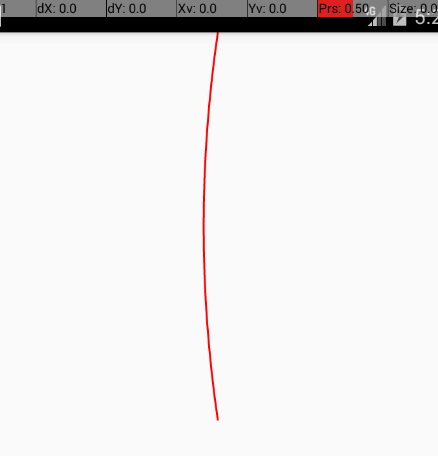

##使用path绘制View

**Path类封装了由直线段，二次曲线和三次曲线组成的复合（多个轮廓）几何路径。 它可以使用canvas.drawPath（路径，绘图）绘制，填充或描边（基于颜料的样式），或者它可以用于剪裁或在路径上绘制文本，下面整合一些基本的方法。**

Path拥有很多方法，下面将介绍一些常用的：

1. void lineTo(float x, float y)--从最后一个点到指定点（x，y）添加一条线。
```java
// 初始化Paint和Path
Paint paint = new Paint();
paint.setAntiAlias(true);//	消除锯齿
paint.setColor(Color.Red);
paint.setStrokeWidth(3);
paint.setStyle(Paint.Style.STROKE);

Path path = new Path();

// onDraw(Canvas canvas)中使用Path进行绘制
@Override。
protected void onDraw(Canvas canvas) {
	super.onDraw(canvas);
	mPath.reset();			// 重置Path
	mPath.lineTo(100, 100);
	mPath.lineTo(100, 200);
	mPath.lineTo(150, 250);
	canvas.drawPath(mPath, mPaint);
}
```
上面代码的效果图：		


2. void moveTo(float x, float y)--将起始轮廓点移至x，y坐标点，默认情况为0,0点
```java
   @Override
    protected void onDraw(Canvas canvas) {
        super.onDraw(canvas);
        mPath.reset();
        mPath.lineTo(100, 100);
        mPath.lineTo(100, 200);
        mPath.lineTo(150, 250);

        canvas.drawPath(mPath, mPaint);
        mPath.reset();
        mPath.moveTo(20, 300);
        mPath.lineTo(50, 350);
        mPath.lineTo(100, 400);
        mPath.lineTo(180, 380);
        mPath.lineTo(250, 380);

        canvas.drawPath(mPath, mPaint);
    }
```
在原来的基础上重置了Path对象，调用moveTo方法将画笔点一移至坐标点（20，500），效果图：


3. void close() --回到初始点形成封闭的曲线
```java
@Override
    protected void onDraw(Canvas canvas) {
        super.onDraw(canvas);
        .....
        .....
        .....
        mPath.lineTo(250, 380);
        mPath.close();

        canvas.drawPath(mPath, mPaint);
    }
```
效果图：


4. void addArc(RectF oval, float startAngle, float sweepAngle)
将指定的弧添加到路径作为新轮廓。参数：
	+ RectF：这个圆弧取自RectF矩形的内接椭圆上的一部分
	+ startAngle：起始位置的角度值
	+ sweepAngle：旋转的角度值
圆弧长度由后两个参数决定
```java
Rect rect = new Rect(100, 100, 300, 250);
canvas.drawRect(rect, mPaint);
// 参考线
canvas.drawLine(50, 175, 350, 175, mPaint);
canvas.drawLine(200, 50, 200, 300, mPaint);
mPath.reset();
mPath.addArc(new RectF(rect), 30, 60);
canvas.drawPath(mPath, mPaint);
```


注意：如果path.addArc(new RectF(rect), -90, -90);
第一个 -90表示，从 -90度开始绘制，第二个 -90 表示 ，逆时针 绘制 90度。

5. void addTo(RectF oval, float startAngle, float sweepAngle)方法
arcTo和addArc的区别:
	1. addArc可以直接加入一段椭圆弧。使用arcTo还需要使用moveTo指定当前点的坐标。
	2. arcTo如果当前点坐标和曲线的起始点不是同一个点的话，还会自动添加一条直线补齐路径。
```java
Rect rect = new Rect(100, 100, 300, 250);
canvas.drawRect(rect, mPaint);
// 参考线
canvas.drawLine(50, 175, 350, 175, mPaint);
canvas.drawLine(200, 50, 200, 300, mPaint);
mPath.reset();
//        mPath.addArc(new RectF(rect), 60, 30);
mPath.moveTo(0,0);
mPath.arcTo(new RectF(rect), 0, 90);
canvas.drawPath(mPath, mPaint);
```


6. void quadTo(float x1, float y1, float x2, float y2)--以当前路径结束点为开始点，(x1,y1)为控制点，(x2,y2)为结束点画一条二次贝塞尔曲线
```java
mPath.reset();
mPath.moveTo(390, 0);
mPath.quadTo(346, 300, 390, 600);
canvas.drawPath(mPath, mPaint);
```
效果图：



7. void addCircle(float x, float y, float radius, Direction dir)

8. addCircle(float x, float y, float radius, Direction dir)--使用path绘制圆形，xy为圆的圆心 radius为圆的半径，Direction 为绘制元的方向(Diection.CCW 逆时针方向,Diection.CW 顺时针方向)

```java
Path path = new Path();

path.reset();
path.addCircle(100, 100, 50, Direction.CW);
canvas.drawPath(path, paint);
```

9. addOval(RectF oval, Path.Direction dir)--绘制椭圆，同上绘制圆的方法

10. addPath(Path src, float dx, float dy)--在已有的Path上通过平移创建新的path,dx,dy分别为偏移量
```java
Path path = new Path();
path.lineTo(100,100); 
path.lineTo(100, 200); 
path.lineTo(150, 250); 

canvas.drawPath(path, paint);
path.addPath(path, 100, 0);
canvas.drawPath(path, paint);
```
效果图：


11. cubicTo(float x1, float y1, float x2, float y2, float x3, float y3)
绘制三次贝塞尔曲线，其中(x1,y1),(x2,y2)为控制点，(x3,y3)为终点
```java
mPath.moveTo(290, 200);
mPath.cubicTo(246, 300, 290, 500, 420, 600);
canvas.drawPath(mPath, mPaint);
```
效果图：


**上面的lineTo,MoveTo,QuadTo,CubicTo方法都有与之对应的rXXX方法：**

rLineTo(float dx, float dy)
rMoveTo(float dx, float dy)
rQuadTo(float dx1, float dy1, float dx2, float dy2)
rCubicTo(float x1, float y1, float x2, float y2, float x3, float y3)
这些方法与之对应的原方法相比，惟一的区别在于：r方法是基于当前绘制开始点的offest,比如当前paint位于 (100,100)处，则使用rLineTo(100,100)方法绘制出来的直线是从(100,100)到(200,200)的一条直接，由此可见rXXX方法方便用来基于之前的绘制作连续绘制。


12. 下面还要介绍一下Path.op方法，这个方法要求API版本最低为19，官网给出的描述是对两个
Path对象做相应的运算组合。
```java
Path path1 = new Path();
path1.addCircle(150, 150, 100, Path.Direction.CW);
Path path2 = new Path();
path2.addCircle(200, 200, 100, Path.Direction.CW);
path1.op(path2, Path.Op.DIFFERENCE);
canvas.drawPath(path1, mPaint);
```

效果图：


**修改op()方法第二个参数可以达到不同的效果：**

Path.Op.INTERSECT效果：


Path.Op.UNION效果：


Path.Op.REVERSE_DIFFERENCE效果：


Path.Op.XOR效果：


画笔设置成stroke可能不是很明显，线面看一下填充后的效果图：


通过drawTextOnPath(Path path, Paint paint)方法可以根据路径绘制文字

```java
   Path path1 = new Path();
        path1.addCircle(150, 150, 100, Path.Direction.CW);
        Path path2 = new Path();
        path2.addCircle(200, 200, 100, Path.Direction.CW);
        path1.op(path2, Path.Op.XOR);
        canvas.drawPath(path1, mPaint);

        mPaint.setTextSize(20);
        canvas.drawTextOnPath("Draw Text On Path",path1, 0 ,0, mPaint);
```

绘制文字后的效果图更容易理解XOR的效果：


**总结:**

Path.Op.DIFFERENCE 减去path1中path1与path2都存在的部分;
path1 = (path1 - path1 ∩ path2)
Path.Op.INTERSECT 保留path1与path2共同的部分;
path1 = path1 ∩ path2
Path.Op.UNION 取path1与path2的并集;
path1 = path1 ∪ path2
Path.Op.REVERSE_DIFFERENCE 与DIFFERENCE刚好相反;
path1 = path2 - (path1 ∩ path2)
Path.Op.XOR 与INTERSECT刚好相反;
path1 = (path1 ∪ path2) - (path1 ∩ path2)

13. offset(float dx, float dy)
平移当前path,在此path上绘制的任何图形都会受到影响
14. reset()
重置path,但不会重置fill-type设置
15. rewind()
重置path,但会保留内部数据结构
16. setLastPoint(float x,float y)
设置当前path的终点

###Android还为路径绘制提供了PathEffect来定义绘制效果,PathEffect包含如下子类
+ ComposePathEffect
+ CornerPathEffect
+ DashPathEffect
+ DiscretePathEffect
+ PathDashPathEffect
+ SumPathEffect

```java
public class PathEffectView extends View {
    private final String TAG = getClass().getSimpleName();

    private float mPhase;
    private PathEffect[] mEffects = new PathEffect[7];
    private int[] mColors;
    private Paint mPaint;
    private Path mPath;

    public PathEffectView(Context context) {
        this(context, null);
    }

    public PathEffectView(Context context, AttributeSet attrs) {
        this(context, attrs, 0);
    }

    public PathEffectView(Context context, AttributeSet attrs, int defStyleAttr) {
        super(context, attrs, defStyleAttr);
        init();
    }

    private void init() {
        mPaint = new Paint();
        mPaint.setStyle(Paint.Style.STROKE);
        mPaint.setStrokeWidth(4);

        mPath = new Path();
        mPath.moveTo(20, 20);
        for (int i = 1; i <= 15; i++) {
            // 生成15个点，绘制一条线
            mPath.lineTo(i * 20, (float) (Math.random() * 60));
        }

        mColors = new int[]{
                Color.BLACK, Color.BLUE, Color.CYAN, Color.GREEN,
                Color.GREEN, Color.MAGENTA, Color.RED, Color.YELLOW
        };
    }

    @Override
    protected void onDraw(Canvas canvas) {
        super.onDraw(canvas);
        // 将背景填充至百色
        canvas.drawColor(Color.WHITE);
        // 下面开始绘制7中路径的效果
        // 使用路径效果
        mEffects[0] = null;
        // 使用CornerPathEffect轮径效果 radius
        mEffects[1] = new CornerPathEffect(10);
        // 使用DiscretePathEffect
        mEffects[2] = new DiscretePathEffect(3.0f, 5.0f);
        // 使用DashPathEffect
        mEffects[3] = new DashPathEffect(new float[]{20, 10, 5, 10}, mPhase);
        // 使用PathDashEffect
        Path p = new Path();
        p.addRect(0, 0, 8, 8, Path.Direction.CCW);
        mEffects[4] = new PathDashPathEffect(p, 12, mPhase, PathDashPathEffect.Style.ROTATE);
        // 初始化ComposePathEffect
        mEffects[5] = new ComposePathEffect(mEffects[2], mEffects[4]);
        // 使用SumPathEffect
        mEffects[6] = new SumPathEffect(mEffects[4], mEffects[3]);
        for (int i = 0; i < mEffects.length; i++) {
            mPaint.setPathEffect(mEffects[i]);
            mPaint.setColor(mColors[i]);
            canvas.drawPath(mPath, mPaint);
            canvas.translate(0, 60);
        }

        // 改变phase值，形成动画效果
        mPhase += 1;
        invalidate();
    }
}
```

效果图：


通过path可以实现很多酷炫的动画效果，感兴趣的话可以自己搞搞。

参考文章：
[android 用Path 绘制各种图形，Path的方法解析](http://blog.csdn.net/legend12300/article/details/51122314)

[android绘图之Path总结](http://www.jianshu.com/p/f1e4fc2feb25)

[Android画图之Path类的使用](http://www.jcodecraeer.com/a/anzhuokaifa/androidkaifa/2013/0222/891.html)


